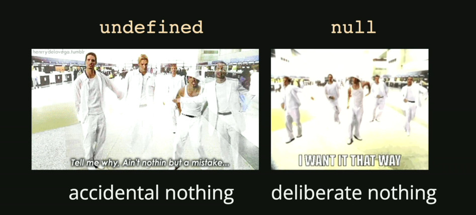

This post is my learning note about some concepts in javascript.

## Table of Contents
- [Table of Contents](#table-of-contents)
- [Data type](#data-type)

## Data type
There are two kinds of data:
- **Primative** (e.g.: string, number, boolean, undefined, null).
  - number: combine int, long, double. 
  - undefined + null: 
    
- **Objects** (e.g.: document & friend).

