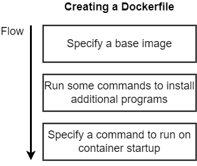

This post is my learning note about some concept in docker. 

## Table of Contents
- [Table of Contents](#table-of-contents)
- [Dive Into Docker](#dive-into-docker)
- [Docker Run in Detail](#docker-run-in-detail)
  - [Comand](#comand)
  - [Note](#note)
- [Building Custom Images](#building-custom-images)
  - [Create a dockerfile](#create-a-dockerfile)
  - [Structure of dockerfile](#structure-of-dockerfile)
  - [Note](#note-1)

## Dive Into Docker
- **Why:** Easy to install and run sofware without worrying about setup or dependencies.
- **What:** An ecosystem around creating and running containers.
- **Core concepts:**
  - *Image:* Snapshot of file systems to run a program with some start up comands.
  - *Container:* Instance of an image for running a program.

## Docker Run in Detail

### Comand

| What | Comand | Description |
|------|--------|-------------|
| Create and run a container from an image | `docker run <image_name> command!` | **run**: try to create and run the container   **command!**: Default overide comand   `docker run busybox ls` or `docker run busybox echo hi` |
| Running a container with port mapping (outside to connect to container) | `docker run -p <port_from_request>:<port_to_container> <image_name>` |  **p**: port mapping |
| Listing running container | `docker ps -a!` | **ps**: list all *running* container     **-a**: listting all *created* container (--all) |
| Restarting stopped container | `docker start -a!` | **-a**: attach, allow to see output of container in terminal |
| Removing stopped container | `docker system prune` | |
| Retrieving log output | `docker logs <container_id>` | |
| Execute an additional command in a container | `docker exec -it <container id> <command>` |  **-it**: allow us to provide input to the container and output from container to screen     **command**: command to execute |

### Note
  - Docker container is isolate from each others.

## Building Custom Images

### Create a dockerfile
 

### Structure of dockerfile

`docker build -t <tag_name> <build context>`
  - **-t <tag_name>**: follow convention : `dockerId/projectName:version` (-t vanduong/redis:latest)
  - **build context**: file or folder using in build proces

| What | Description | Examples |
|------|-------------|----------|
| FROM | Spcecify a base image | FROM alpine |
| RUN | Run comands to install additional program | RUN apk add --update redis |
| CMD | Comand to run on startup | CMD [ "redis-server" ] |
| COPY | Copy files to container | COPY ./ ./ |
| WORDIR | Any following command will be executed relative to this path in the container | WORKDIR /usr/app |

### Note
  - FROM keywork following by <image_name>:<version> (node:14-alpine)
  - COPY keyword should use cache for dependencies when building following this format for minimizing time consumption when building images: 
  `COPY <depencies_files>` > `RUN <install>` > `COPY <changeable_files (source code)>`

 